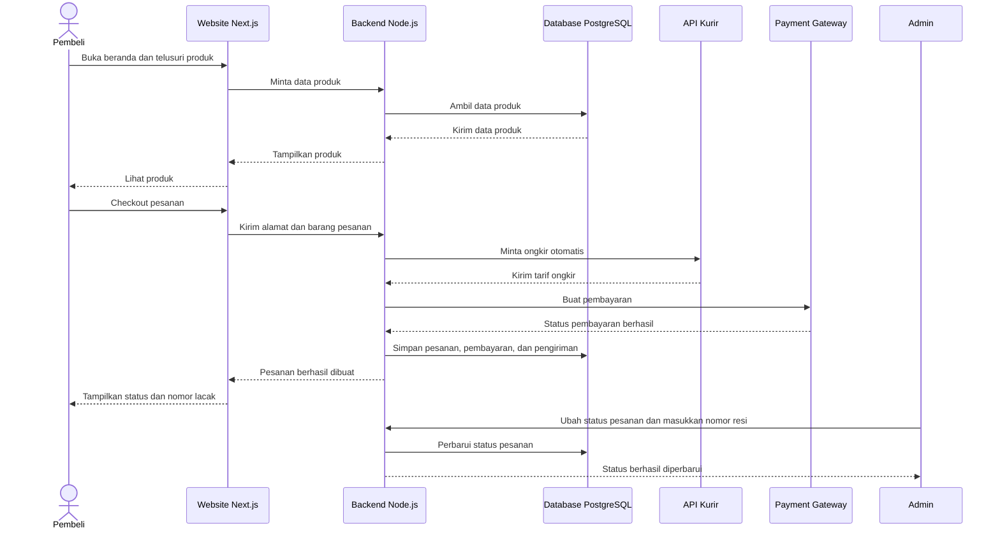
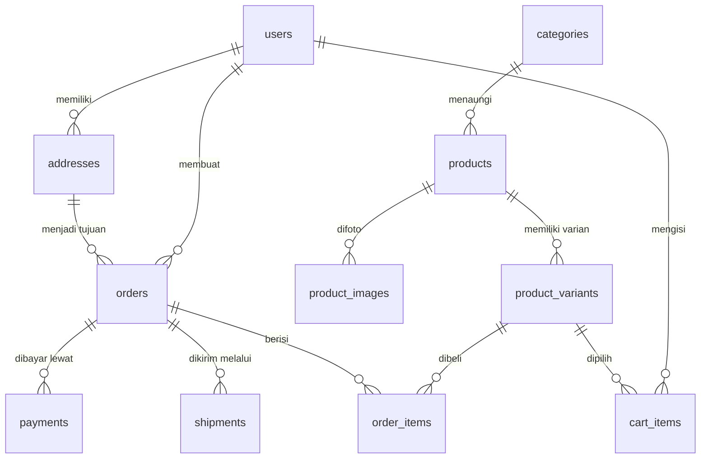

# PRD — Project Requirements Document

## 1. Overview

Aplikasi ini adalah **toko online kebutuhan anak** yang menjual perlengkapan anak, pakaian anak, dan mainan anak. Masalah utama yang ingin diselesaikan adalah orang tua sering kesulitan mencari kebutuhan anak karena harus berpindah-pindah toko, sulit membandingkan harga, dan tidak tahu produk mana yang sedang populer atau sedang diskon.

Tujuan utama aplikasi adalah menghadirkan pengalaman belanja ala **marketplace populer di Indonesia**: pembeli bisa melihat produk populer, terbaru, dan rekomendasi; mencari dan menyaring produk; memasukkan barang ke keranjang; checkout dengan ongkir otomatis ke seluruh Indonesia; melacak pesanan; serta pengelola toko bisa mengelola produk, promo, dan pesanan lewat panel admin.

Aplikasi memiliki tiga area utama:

- **Halaman utama** — beranda toko untuk semua pengunjung.
- **Halaman user** — halaman pribadi pembeli untuk akun, alamat, keranjang, dan riwayat pesanan.
- **Halaman admin** — panel khusus untuk mengelola toko.

## 2. Requirements

Persyaratan utama proyek ini meliputi:

- Toko menjual paling sedikit tiga kategori produk: **perlengkapan anak**, **pakaian anak**, dan **mainan**.
- Halaman utama menampilkan produk populer, produk terbaru, rekomendasi untuk anak, dan promo hemat rutin.
- Pembeli dapat mencari produk, menyaring berdasarkan kategori, mengurutkan berdasarkan harga, dan melihat detail produk.
- Setiap produk menampilkan foto, pilihan ukuran dan warna, bahan, usia yang cocok, stok, serta tombol tambah ke keranjang.
- Keranjang belanja dapat diubah jumlah barangnya, dihapus, dan menampilkan ringkasan harga.
- Checkout mendukung pengisian alamat pengiriman ke seluruh Indonesia, pilihan kurir, ongkir otomatis, pilihan metode pembayaran, dan ringkasan pesanan sebelum bayar.
- Pembeli memiliki akun pribadi untuk masuk, keluar, memperbarui profil, dan menyimpan beberapa alamat.
- Pembeli dapat melihat riwayat pesanan, melacak paket, mengonfirmasi barang diterima, dan membeli lagi.
- Admin dapat memantau ringkasan penjualan, mengelola produk, mengubah status pesanan sampai barang dikirim, dan mengelola promo.
- Aplikasi harus cepat, mudah digunakan di HP maupun komputer, dan aman.

## 3. Core Features

Fitur inti disusun berdasarkan fase pengembangan berikut.

### Fase 1 — Beranda Toko

- **Produk Populer** — Menampilkan produk yang paling banyak dibeli sehingga pembeli tahu barang yang sedang disukai orang tua lain.
- **Produk Terbaru** — Menampilkan koleksi barang baru yang baru masuk toko.
- **Rekomendasi untuk Anak** — Menampilkan saran produk yang sesuai dengan kategori, minat, dan riwayat belanja pembeli.
- **Promo Hemat Rutin** — Menampilkan produk diskon secara berkala agar pembeli merasa lebih hemat.

### Fase 2 — Cari, Lihat Produk, dan Keranjang

- **Cari & Saring Produk**
  - Cari kata kunci: pembeli mengetik nama produk dan langsung melihat hasil yang cocok.
  - Saring kategori: menampilkan hanya perlengkapan, pakaian anak, atau mainan.
  - Urutkan harga: mengurutkan produk dari termurah ke termahal.
- **Detail Produk**
  - Foto produk: menampilkan beberapa sudut foto produk.
  - Pilih ukuran & warna: pembeli memilih varian yang cocok untuk anaknya.
  - Info bahan & stok: menampilkan bahan, usia yang cocok, dan ketersediaan barang.
  - Tambah ke keranjang: menyimpan produk pilihan ke keranjang belanja.
- **Keranjang Belanja**
  - Ubah jumlah: menambah atau mengurangi jumlah barang.
  - Hapus barang: mengeluarkan barang yang tidak jadi dibeli.
  - Ringkasan harga: melihat total harga dari semua barang di keranjang.

### Fase 3 — Checkout & Pengiriman

- **Isi alamat** — Pembeli mengisi alamat tujuan pengiriman ke mana pun di Indonesia.
- **Pilih kurir** — Pembeli memilih jasa kirim dan ongkir dihitung otomatis.
- **Pilih pembayaran** — Pembeli memilih metode pembayaran yang tersedia.
- **Periksa pesanan** — Pembeli memeriksa kembali daftar barang, alamat, ongkir, dan total sebelum membayar.

### Fase 4 — Status Pesanan & Akun Pengguna

- **Status Pesanan**
  - Riwayat pesanan: melihat daftar semua pesanan beserta statusnya.
  - Lacak paket: mengikuti posisi paket selama proses pengiriman.
  - Konfirmasi terima: menandai pesanan sudah diterima dengan baik.
  - Beli lagi: memesan ulang produk yang sama tanpa mencarinya lagi.
- **Akun Pengguna**
  - Daftar & masuk: membuat akun baru atau masuk ke akun yang sudah ada.
  - Profil saya: melihat dan memperbarui data diri pembeli.
  - Buku alamat: menyimpan lebih dari satu alamat agar checkout lebih cepat.
  - Keluar akun: mengakhiri sesi masuk dengan aman.

### Fase 5 — Panel Admin

- **Pantau penjualan** — Melihat ringkasan jumlah pesanan dan total penjualan toko.
- **Kelola produk** — Menambah, mengubah, atau menonaktifkan produk yang dijual.
- **Proses pesanan** — Mengubah status pesanan dari dibayar, diproses, hingga dikirim.
- **Kelola promo** — Membuat dan mengatur diskon rutin untuk menarik pembeli.

## 4. User Flow

### Alur Pembeli

1. Pembeli membuka **halaman utama** dan melihat produk populer, produk terbaru, rekomendasi, serta promo.
2. Pembeli mencari barang dengan kata kunci, atau menyaring berdasarkan kategori dan mengurutkan harga.
3. Pembeli membuka **halaman detail produk**, memilih ukuran dan warna, lalu menekan **Tambah ke Keranjang**.
4. Pembeli membuka keranjang, mengubah jumlah atau menghapus barang, lalu menekan **Checkout**.
5. Jika belum masuk, pembeli diminta **daftar atau masuk** terlebih dahulu.
6. Pembeli mengisi alamat pengiriman, memilih kurir, melihat ongkir otomatis, memilih metode pembayaran, lalu memeriksa kembali pesanan.
7. Pembeli menyelesaikan pembayaran dan mendapat status pesanan.
8. Pembeli memantau pengiriman dari halaman **Status Pesanan**.
9. Setelah paket diterima, pembeli menekan **Konfirmasi Terima**.
10. Jika ingin membeli produk yang sama lagi, pembeli bisa memilih **Beli Lagi** dari riwayat pesanan.

### Alur Admin

1. Admin masuk ke akun admin.
2. Admin membuka **halaman admin** dan melihat ringkasan penjualan.
3. Admin menambah atau mengubah produk, serta mengatur promo yang sedang berjalan.
4. Admin menerima pesanan baru, lalu mengubah status pesanan dari dibayar menjadi **diproses**.
5. Admin mengirim pesanan dengan memasukkan nomor resi kurir.
6. Status pesanan pembeli pun berubah menjadi **dikirim** dan bisa dilacak.

## 5. Architecture

Sistem ini terdiri dari tiga bagian utama:

1. **Website** — dibangun dengan Next.js sebagai halaman toko, halaman user, dan panel admin.
2. **Backend** — layanan API berbasis Node.js yang memproses data produk, keranjang, pesanan, promo, dan akun pengguna.
3. **Database & Layanan pendukung** — PostgreSQL menyimpan seluruh data. Backend berkomunikasi dengan layanan kurir untuk menghitung ongkir, dan payment gateway untuk memproses pembayaran.

Diagram alur berikut menggambarkan cara kerja aplikasi saat pembeli berbelanja:

Semua bagian ini dijalankan di **server VPS**. Website dan backend dapat berjalan sebagai dua layanan terpisah di VPS yang sama, dengan database PostgreSQL.

## 6. Database Schema

Model data disimpan di **PostgreSQL**. Berikut tabel utama beserta kolom dan kegunaannya.

### users — akun pembeli dan admin
- `id` — primary key.
- `nama` — nama pengguna.
- `email` — alamat email untuk masuk, unik.
- `password_hash` — kata sandi yang sudah dienkripsi.
- `role` — peran pengguna: `pembeli` atau `admin`.

### addresses — buku alamat pengiriman
- `id` — primary key.
- `user_id` — foreign key ke tabel `users`.
- `label` — nama alamat, misal: Rumah, Kantor.
- `nama_penerima` — nama orang yang menerima paket.
- `nomor_hp` — nomor HP penerima.
- `provinsi`, `kota`, `kecamatan`, `kode_pos` — lokasi tujuan.
- `alamat_lengkap` — detail alamat seperti nama jalan, nomor rumah, dan patokan.
- `is_default` — penanda alamat utama.

### categories — kategori produk
- `id` — primary key.
- `nama_kategori` — nama kategori, contoh: Perlengkapan Anak, Pakaian Anak, Mainan.
- `deskripsi` — penjelasan singkat kategori.

### products — produk yang dijual
- `id` — primary key.
- `category_id` — foreign key ke tabel `categories`.
- `nama_produk` — nama produk.
- `deskripsi` — deskripsi produk.
- `harga` — harga jual produk.
- `bahan` — bahan produk atau pakaian.
- `usia_cocok` — rentang usia anak yang cocok.
- `is_active` — status produk aktif atau tidak.
- `dibuat_pada` — waktu produk dimasukkan.

### product_images — foto produk
- `id` — primary key.
- `product_id` — foreign key ke tabel `products`.
- `url_gambar` — lokasi foto produk.
- `urutan` — urutan tampilan foto.

### product_variants — varian ukuran dan warna produk
- `id` — primary key.
- `product_id` — foreign key ke tabel `products`.
- `ukuran` — ukuran produk, misal S, M, L, atau ukuran usia.
- `warna` — warna produk.
- `sku` — kode unik varian produk.
- `stok` — jumlah stok tersedia.

### promos — program diskon rutin
- `id` — primary key.
- `nama_promo` — nama promo.
- `jenis` — jenis diskon, misal persen atau nominal rupiah.
- `nilai` — besar diskon.
- `tanggal_mulai` — waktu promo dimulai.
- `tanggal_selesai` — waktu promo berakhir.
- `is_active` — status promo aktif.

### cart_items — isi keranjang belanja
- `id` — primary key.
- `user_id` — foreign key ke tabel `users`.
- `product_variant_id` — foreign key ke tabel `product_variants`.
- `jumlah` — jumlah barang yang dimasukkan ke keranjang.

### orders — data pesanan
- `id` — primary key.
- `nomor_pesanan` — nomor unik pesanan untuk memudahkan pelacakan.
- `user_id` — foreign key ke tabel `users`.
- `address_id` — foreign key ke tabel `addresses`, alamat tujuan pengiriman.
- `status` — status pesanan, misal menunggu pembayaran, diproses, dikirim, selesai.
- `subtotal` — total harga barang sebelum ongkir dan diskon.
- `ongkir` — biaya pengiriman.
- `diskon` — potongan harga dari promo.
- `total` — jumlah yang harus dibayar.

### order_items — daftar barang dalam pesanan
- `id` — primary key.
- `order_id` — foreign key ke tabel `orders`.
- `product_variant_id` — foreign key ke tabel `product_variants`.
- `nama_produk` — salinan nama produk saat dibeli.
- `varian` — salinan pilihan ukuran dan warna.
- `harga_satuan` — harga per barang saat dibeli.
- `jumlah` — jumlah barang yang dibeli.

### shipments — data pengiriman
- `id` — primary key.
- `order_id` — foreign key ke tabel `orders`.
- `kurir` — nama jasa kirim, misal JNE, SiCepat, atau kurir lain.
- `layanan` — layanan pengiriman, misal REG, Express.
- `nomor_resi` — nomor resi untuk melacak paket.
- `status_pengiriman` — posisi paket dari pihak kurir.
- `perkiraan_tiba` — estimasi barang sampai ke pembeli.
- `diperbarui_pada` — waktu status pengiriman diperbarui.

### payments — data pembayaran
- `id` — primary key.
- `order_id` — foreign key ke tabel `orders`.
- `metode_bayar` — metode pembayaran yang dipilih pembeli.
- `status_pembayaran` — status bayar, misal menunggu, berhasil, gagal.
- `jumlah_bayar` — total uang yang dibayar.
- `referensi_pembayaran` — kode referensi dari layanan pembayaran.
- `dibayar_pada` — waktu pembayaran berhasil.

Berikut diagram relasi antar tabel:

## 7. Tech Stack

Rekomendasi teknologi untuk membangun aplikasi ini:

- **Frontend** — Next.js dengan Tailwind CSS dan shadcn/ui untuk antarmuka yang rapi serta cepat dimuat di HP dan komputer.
- **Backend** — Node.js menggunakan Express atau Fastify sebagai REST API untuk melayani semua proses bisnis toko.
- **Database** — PostgreSQL sebagai database utama untuk menyimpan data produk, pengguna, pesanan, dan pembayaran.
- **ORM** — Drizzle ORM untuk mempermudah pengelolaan dan migrasi database.
- **Autentikasi** — Better Auth untuk mengelola daftar, masuk, keluar, dan sesi pengguna pembeli serta admin.
- **Pengiriman** — Integrasi API kurir seperti RajaOngkir, Biteship, atau Shipper untuk menghitung ongkir otomatis dan menyediakan nomor lacak ke seluruh Indonesia.
- **Pembayaran** — Payment gateway seperti Midtrans atau Xendit agar pembeli bisa memilih metode pembayaran yang nyaman.
- **Deployment** — VPS dengan Nginx sebagai web server dan PM2 atau Docker Compose untuk menjalankan website, backend, dan database.

Dengan kombinasi ini, aplikasi dapat dikembangkan bertahap sesuai fase fitur, mulai dari halaman utama, keranjang, checkout, hingga panel admin.